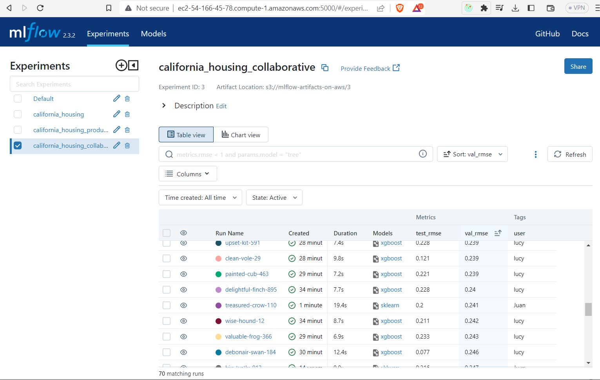
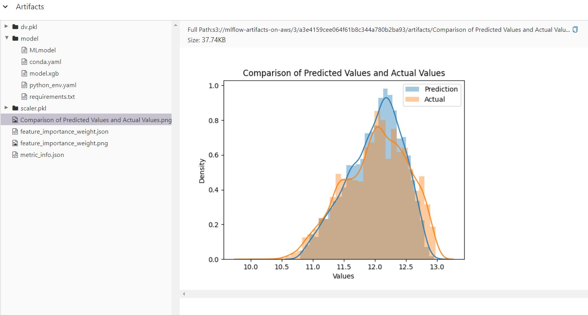
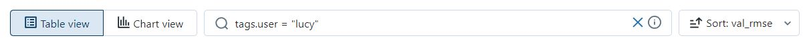
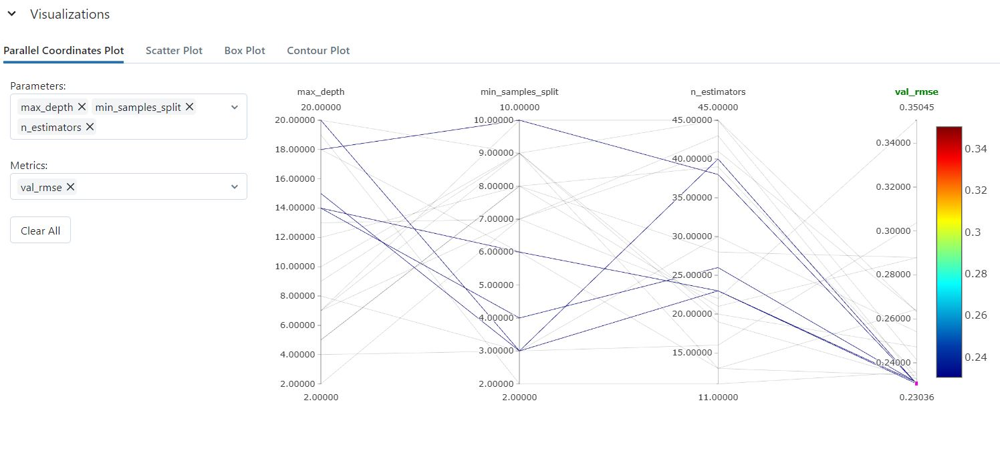

<p align="center">
  <a href="" rel="noopener">
 </a>
</p>
<h3 align="center">MLFlow on AWS</h3>

<div align="center">

[](http://hackathon.url.com)
[](http://hackathon.url.com)
[](http://hackathon.url.com)
[](LICENSE.md)

</div>

---

<p align="center"> When creating a machine learning/data science team, you may encounter challenges. This notebook presents a proposed solution using MLflow and AWS to address these difficulties.
    <br> 
</p>

## 📝 Table of Contents

- [Problem Statement](#problem_statement)
- [Idea / Solution](#idea)
- [Technology Stack](#tech_stack)
- [Deployment on AWS](#deployment)
  - [Creating an EC2 Instance](#ec2)
  - [Configuring PostgreSQL Database](#postgresql)
  - [Configuring S3 bucket](#s3)
  - [Running MLFlow Server on EC2](#mlflow_run)
- [Setting up a local environment](#getting_started)
- [Usage](#usage)
- [Authors](#authors)
- [Acknowledgments](#acknowledgments)

## 🧐 Problem Statement <a name = "problem_statement"></a>

When working with multiple data scientists on a single problem or multiple projects simultaneously, it's important to implement an effective strategy to prevent conflicts and ensure smooth collaboration. Some common challenges include:

Avoiding overwriting of experiments.
Preventing interference with others' experiments.
Identifying the best experiment among all data scientists.
Filtering historical results based on user, time, hyperparameters, and configurations.
The task at hand is to predict housing prices in California using the California housing dataset. The objective is to design a collaborative project where different data scientists approach the problem in their own way using MLflow.

## 💡 Idea / Solution <a name = "idea"></a>

The idea is to demonstrate how MLFlow can be utilized in a collaborative team to address the California housing price prediction problem. Each data scientist will have their own experimentation notebook. The outputs of all experiments will be stored on AWS.

Where is the data saved?

- [Backend Stores]() - The backend store is where MLflow Tracking Server stores experiment and run metadata as well as params, metrics, and tags for runs. We will use PostgreSQL for that purpose.
- [Artifact Stores]() - The artifact store is a location suitable for large data. In general is for saving images, models, model weights or any file related to the run. We will use Amazon S3 for that purpose.

Dataset: https://www.kaggle.com/datasets/camnugent/california-housing-prices


## ⛏️ Built With <a name = "tech_stack"></a>

- [Postgres]() - Database
- [Python]() - Machine Learning
- [Matplotlib & Seaborn]() -Visualization
- [MLFlow]() - Experiment Tracking
- [AWS]() - Cloud

## 📊 Results and Visualizations <a name = "results"></a>

* Artifacts attached to a run

<p align="center">
  <a href="" rel="noopener">
  </a>
</p>

* Filtering in MLFlow UI

<p align="center">
  <a href="" rel="noopener">
  </a>
</p>

* Check the params relations in Parallel Coordinates Plot

<p align="center">
  <a href="" rel="noopener">
  </a>
</p>


## 🚀 Deployment on AWS <a name="deployment"></a>

### Creating an EC2 Instance <a name="ec2"></a>

To deploy MLFlow on AWS, you'll first need to create an EC2 instance. Here are the steps:

- Log in to the AWS Management Console.
- Navigate to the EC2 service.
- Click on "Launch Instance" to start the instance creation process.
- Choose an Amazon Machine Image (AMI) that suits your requirements.
- Configure security groups to allow inbound traffic on the desired ports (e.g., SSH, HTTP, HTTPS).

### Configuring PostgreSQL Database <a name="postgresql"></a>

To use PostgreSQL as the backend store for MLFlow, you'll need to configure a PostgreSQL database. Follow these steps:

- Create a PostgreSQL database in Amazon RDS service.
- Configure the setting according to your requirements
- Configure security groups to allow inbound traffic on the desired ports (e.g., SSH, HTTP, HTTPS).
- Make note of the PostgreSQL database URI, which should include the username, password, host, port, and database name.

### Configuring S3 bucket <a name="s3"></a>

Follow these steps to configure the S3 bucket:

- Navigate to the S3 service.
- Create a new S3 bucket for storing MLFlow artifacts.
- Copy your S3 URI

### Running MLFlow Server on EC2 <a name="mlflow_run"></a>

Now, we're ready to run the MLFlow server on the EC2 instance:

- Connect to the EC2 instance via SSH.
- Update the packages in your virtual machine
- install python and pip in your machine
- Run this command against your bash

```bash
mlflow server --backend-store-uri postgresql://{USER_NAME}:{PASSWORD}@{HOST}:5432/{DATABASE_NAME} --default-artifact-root s3://{S3_BUCKET_NAME} -p 5000 -h 0.0.0.0
```

- You can now access the MLFlow server by navigating to `http://<EC2_INSTANCE_PUBLIC_IP>:5000` in your web browser.

Remember to configure security groups and network settings to allow inbound traffic on the specified port for accessing the MLFlow server.

## 🏁 Getting Started <a name = "getting_started"></a>

These instructions will get you a copy of the project up and running on your enviroment for production.

### Prerequisites

- Make sure you have the following software installed:

```
- Python
- Pipenv
```

- You must have an AWS account

### Installing

1. Clone the repository:

```bash
git clone https://github.com/alejomaar/mlflow_on_aws
```

2. Install dependencies with pipenv:

```bash
pipenv install
```

```bash
pipenv shell
```

2. (Optional) Install dependencies with other python package manager:

```bash
pip install -r requirements.txt
```

3. Set your environment variables:

- Change the name of 'env_placeholder' to '.env' and change it with your own environment variables

4. Run MLFlow:

**Run Locally:**

```bash
mlflow server --backend-store-uri sqlite:///mlflow.db --default-artifact-root ./mlflow/artifacts --host 0.0.0.0 -p 4600
```

**Run in Production:**

You will need to have a EC2 instance already running on AWS, so you need run this command into the instance. (`Check the deployment section for more information`)

```bash
mlflow server --backend-store-uri postgresql://{USER_NAME}:{PASSWORD}@{HOST}:5432/{DATABASE_NAME} --default-artifact-root s3://{S3_BUCKET_NAME} -p 5000 -h 0.0.0.0
```

4. Run any notebooks

## 🎈 Usage <a name="usage"></a>

- `Run Notebooks`: Each notebook presents a different approach to predict housing prices on the California dataset. It is recommended to run all the notebooks to explore the different models and compare their results.
- `Experiment`: Modify the parameters in your experiments. You can add more visualizations, export additional artifacts, and apply different feature engineering techniques to achieve better results.

## ✍️ Authors <a name = "authors"></a>

- [@alejomaar](https://github.com/alejomaar) - Idea & Initial work

## 🎉 Acknowledgments <a name = "acknowledgments"></a>

- This notebook is inspired in the teachings of [mlops-zoomcamp](https://github.com/DataTalksClub/mlops-zoomcamp)
- If you want to a tutorial about the entire process I recommend you this [tutorial](https://www.youtube.com/watch?v=1ykg4YmbFVA&list=PL3MmuxUbc_hIUISrluw_A7wDSmfOhErJK&index=19)
